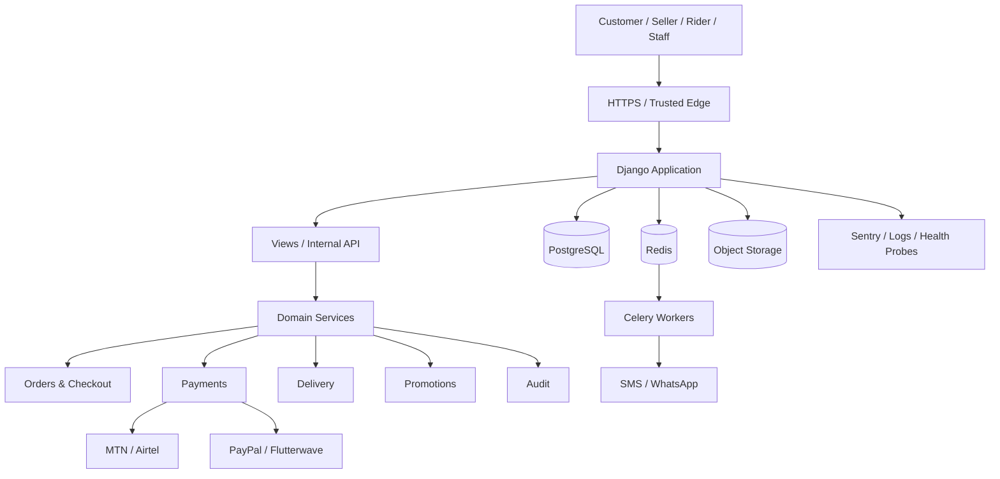
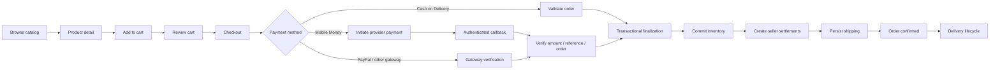
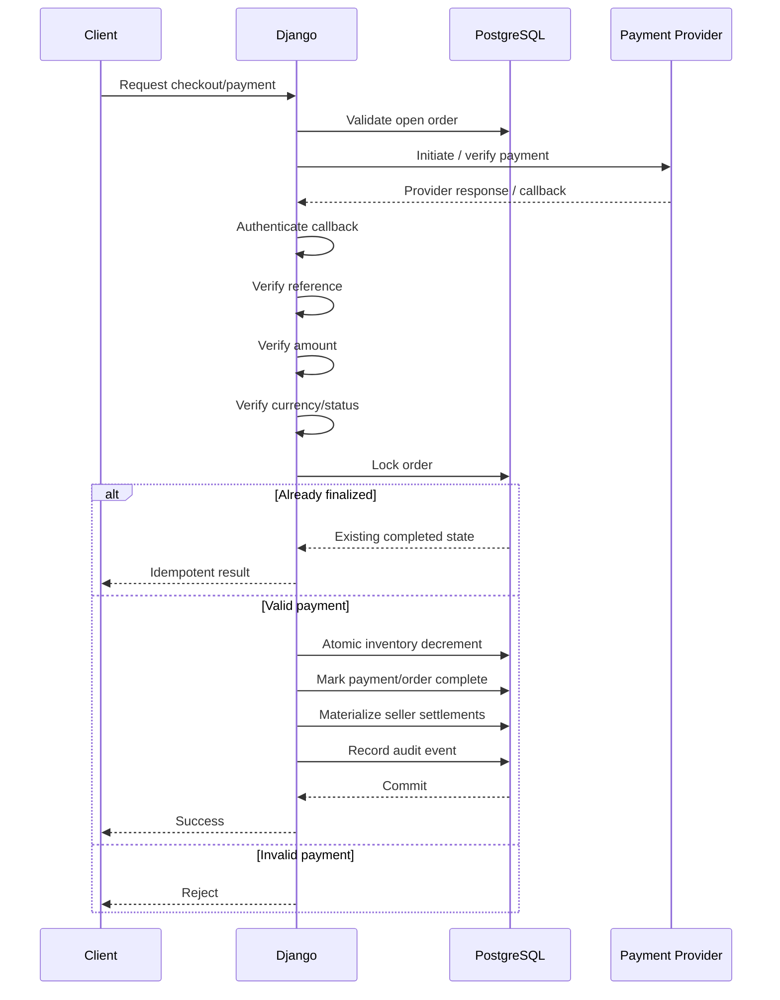
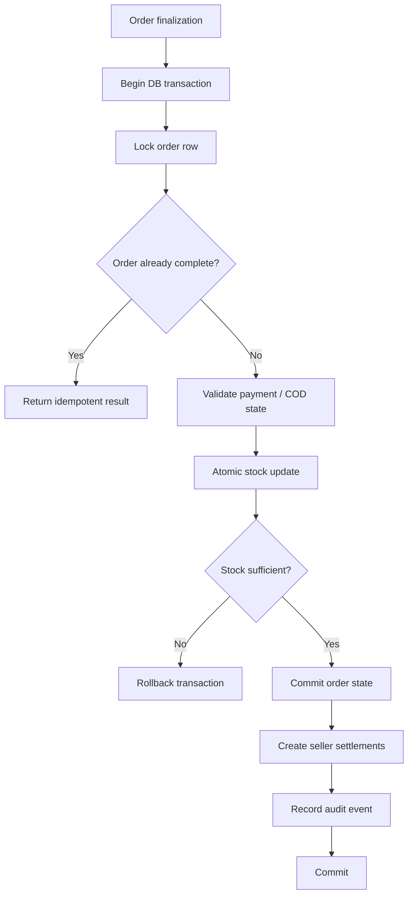
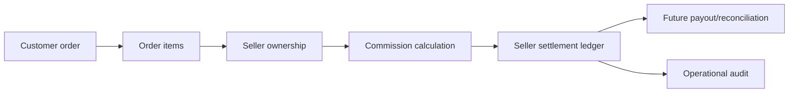
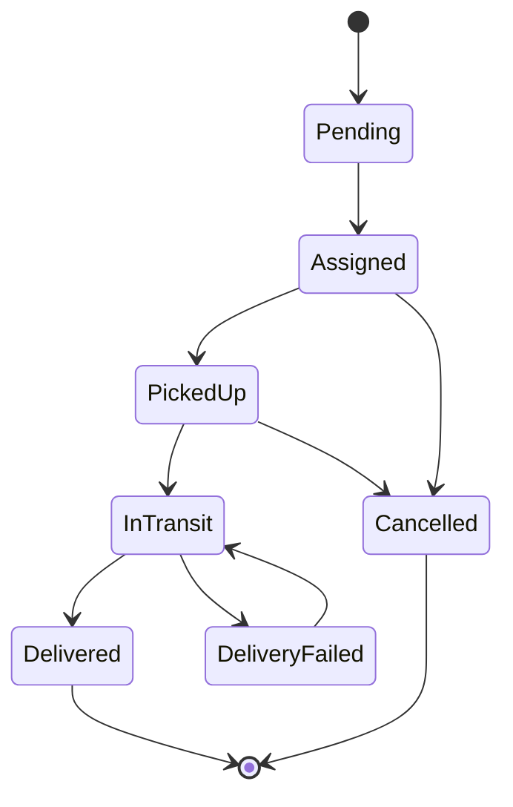
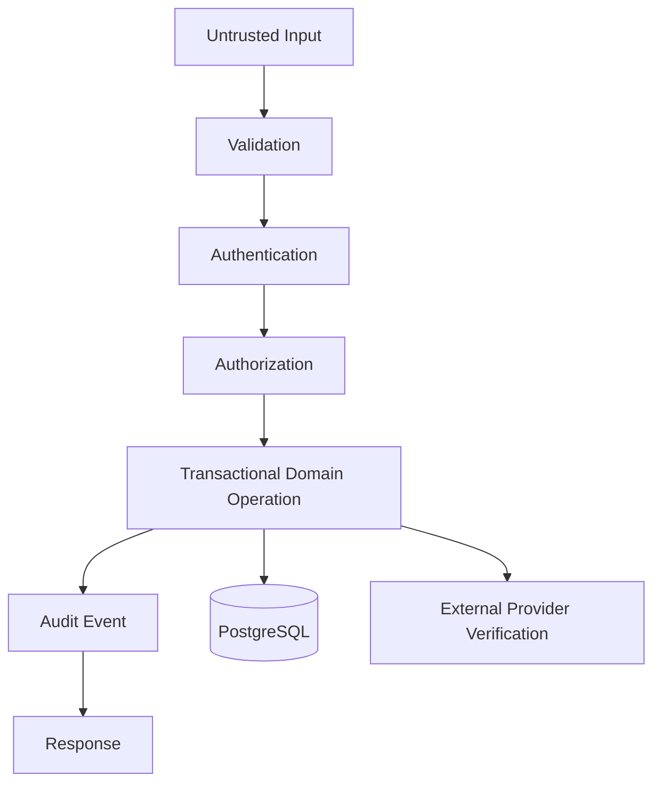
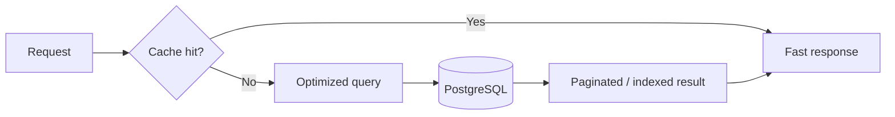
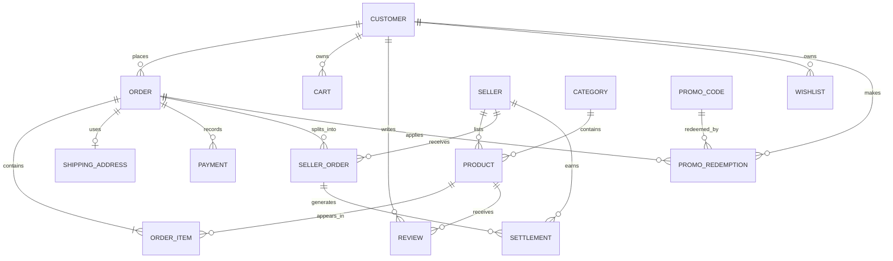

# Agri-Market

> **Production-oriented agricultural commerce platform for Uganda.**

[](https://github.com/PerezChris99/Agri-Market-E-Commerce/actions/workflows/ci.yml)
[](https://www.djangoproject.com/)
[](https://www.python.org/)
[](https://www.postgresql.org/)
[](https://redis.io/)
[](LICENSE)

**Copyright © 2026 Kweezi Perez. All rights reserved except as expressly granted under the MIT License.**

Agri-Market is a Django-based agricultural marketplace connecting Ugandan farmers and sellers with consumers and larger buyers. The platform is designed around local commerce requirements including UGX pricing, Mobile Money, Uganda-wide delivery zones, seller verification, delivery operations, promotions, reviews, and marketplace settlement.

The engineering objective is:

> **Secure transactions. Strong data integrity. Predictable performance. Observable operations. Controlled deployments.**

---

## Table of contents

- [Platform overview](#platform-overview)
- [Core capabilities](#core-capabilities)
- [System architecture](#system-architecture)
- [Commerce flow](#commerce-flow)
- [Payment flow](#payment-flow)
- [Inventory and order integrity](#inventory-and-order-integrity)
- [Marketplace and settlement flow](#marketplace-and-settlement-flow)
- [Delivery flow](#delivery-flow)
- [Security architecture](#security-architecture)
- [Performance engineering](#performance-engineering)
- [Data model](#data-model)
- [API surface](#api-surface)
- [Repository structure](#repository-structure)
- [Local development](#local-development)
- [Production configuration](#production-configuration)
- [Testing and quality gates](#testing-and-quality-gates)
- [CI/CD](#cicd)
- [Production boundary](#production-boundary)
- [Deployment principles](#deployment-principles)
- [Copyright and license](#copyright-and-license)

---

## Platform overview

Agri-Market is intentionally implemented as a **modular Django monolith**.

The architecture keeps the transactional core in one deployable application while separating important business responsibilities into service modules. This provides strong transactional consistency without introducing the operational complexity of premature microservices.

### Design priorities

| Area | Engineering objective |
|---|---|
| Commerce | Correct carts, checkout, orders, promotions, and historical pricing |
| Payments | Verified, authenticated, idempotent payment processing |
| Inventory | Atomic stock changes and concurrency protection |
| Marketplace | Seller ownership, commissions, settlements, and auditability |
| Delivery | Authorization, status history, GPS events, and operational traceability |
| Security | Defense in depth, secure defaults, rate limiting, CSP, and least privilege |
| Performance | Indexed queries, bounded result sets, caching, and relationship preloading |
| Reliability | Transactions, health probes, audit events, and failure-aware integrations |
| Operations | CI gates, migration checks, dependency auditing, and observability hooks |

---

## Core capabilities

### Commerce

- Agricultural product catalog and category browsing
- Search, filtering, sorting, and pagination
- Persistent authenticated carts
- Cookie-based anonymous carts
- Guest Cash on Delivery checkout
- Authenticated electronic-payment checkout
- Order history and order detail views
- Wishlists
- Verified product reviews and review images
- Promotional codes with redemption ledger
- Immutable purchase-time pricing

### Payments

- MTN Mobile Money
- Airtel Money
- PayPal
- Flutterwave integration architecture
- Cash on Delivery
- Server-side payment/reference validation
- Authenticated webhook verification
- Payment idempotency
- Atomic inventory commitment
- Rate-limited payment endpoints

### Marketplace

- Farmer/seller profiles
- Seller verification state
- Seller-specific order records
- Commission calculation
- Seller settlement ledger
- Seller payout ledger
- Bulk-order foundation

### Delivery

- Uganda delivery zones
- Delivery pricing/free-delivery thresholds
- Rider accounts
- Delivery status history
- GPS location history
- Customer/rider/staff authorization boundaries
- Delivery tracking endpoints
- Delivery OTP foundation

### Operations

- Django administration
- Sales/operational analytics
- Redis caching
- Celery background-task infrastructure
- S3-compatible media storage
- Sentry integration hooks
- Liveness/readiness health endpoints
- Operational audit logging
- Migration drift detection
- Dependency vulnerability auditing

---

# System architecture

The production topology is designed around a transactional Django core with managed infrastructure and external provider boundaries.



### Architectural principles

1. **PostgreSQL is the transactional source of truth.**
2. **Redis is an acceleration and asynchronous-work dependency, not the system of record.**
3. **External payment providers are treated as untrusted boundaries until server-side verification succeeds.**
4. **Critical order and inventory changes occur inside database transactions.**
5. **Slow or retryable work is moved toward Celery/background execution.**
6. **Provider-specific integrations remain behind application boundaries so the commerce domain is not coupled to one vendor.**

---

# Commerce flow

The primary customer journey is:



### Checkout invariants

A successful order must satisfy all applicable invariants:

- the order belongs to the expected customer/session;
- the order is not already complete;
- the order contains at least one item;
- the payment method is supported;
- electronic payments have passed server-side verification;
- the payment amount matches the expected order amount;
- inventory can be committed atomically;
- seller settlement records can be materialized;
- shipping information is persisted consistently.

---

# Payment flow

Payment processing is deliberately separated from order finalization.



### Payment security boundary

The browser is **not** trusted to determine:

- final payment status;
- transaction identity;
- payment amount;
- inventory availability;
- order completion;
- seller settlement values.

Those decisions are made server-side.

---

# Inventory and order integrity

Inventory is protected against duplicate callbacks and concurrent buyers.



The critical stock operation is designed around an atomic database update rather than a vulnerable application-level read-then-write sequence.

Historical order pricing is stored on the order item so later product price changes do not rewrite historical transactions.

---

# Marketplace and settlement flow



The settlement ledger is an accounting boundary. Automated payout execution and reconciliation remain separate production milestones and must not be implied by the existence of settlement records alone.

---

# Delivery flow



Delivery updates are authorization-controlled. Customer, rider, and staff permissions are deliberately different.

GPS/location data is treated as operationally sensitive and is not exposed through unrestricted endpoints.

---

# Security architecture

Security is implemented as defense in depth.

### Application controls

- HTTPS enforcement in production
- Secure and HttpOnly cookies
- SameSite cookie controls
- CSRF protection
- strict host validation
- HSTS
- clickjacking protection
- content-type sniffing protection
- referrer policy
- Cross-Origin Opener/Resource policies
- Content Security Policy
- Argon2 password hashing
- request and upload-size limits
- login/mutation/payment rate limiting
- signed/authenticated provider callbacks
- server-side payment verification
- open-redirect protection
- object ownership checks
- seller KYC/payout access restrictions
- safe JSON error responses
- dependency vulnerability scanning

### Security model



No client-controlled value should be treated as authoritative merely because it arrived through an authenticated browser session.

---

# Performance engineering

The application uses database-first performance controls rather than relying on frontend optimization alone.

### Implemented performance controls

- PostgreSQL indexes on common access paths
- `pg_trgm` GIN indexes for scalable product substring search
- composite indexes aligned to real filters/orderings
- cached navigation categories
- cached homepage aggregates
- annotated product ratings
- batched anonymous-cart product lookup
- batched cart merging
- `select_related()` and `prefetch_related()`
- persistent database connections in production
- Redis-backed caching when configured
- Celery infrastructure for asynchronous work
- WhiteNoise production static-file handling
- S3-compatible media storage
- bounded pagination for user-visible collections

### Performance model



Performance optimizations must preserve correctness. Cache invalidation, transaction boundaries, and stale-data risk therefore remain part of the design review for every optimization.

---

# Data model

The primary domain relationships can be represented as:



The database additionally enforces business invariants through foreign keys, unique constraints, conditional constraints, indexes, and transactional locking.

---

# API surface

### Commerce

```text
POST /update_item/
POST /add-to-cart/<product_id>/
POST /process_order/
POST /toggle-wishlist/
```

### Payments

```text
POST /api/momo/initiate/
GET  /api/momo/status/
POST /api/momo/callback/
```

### Delivery

```text
GET  /api/delivery/<order_id>/
POST /api/delivery/<order_id>/location/
POST /api/delivery/<order_id>/status/
```

### Operations

```text
GET /health/live/
GET /health/ready/
```

The current `/api/` surface is an internal application API. A public versioned REST/mobile API is a separate product milestone.

---

# Repository structure

```text
Agri-Market-E-Commerce/
├── ecommerce/
│   ├── settings.py
│   ├── urls.py
│   ├── celery.py
│   └── wsgi.py
│
├── store/
│   ├── models.py
│   ├── views.py
│   ├── forms.py
│   ├── payments.py
│   ├── sms.py
│   ├── health.py
│   ├── utils.py
│   ├── tasks.py
│   ├── services/
│   │   ├── audit.py
│   │   ├── delivery.py
│   │   ├── orders.py
│   │   ├── payments.py
│   │   └── promotions.py
│   ├── migrations/
│   ├── management/
│   ├── templates/
│   └── tests.py
│
├── static/
│   ├── css/
│   ├── js/
│   └── images/
│
├── .github/
│   └── workflows/
│       └── ci.yml
│
├── .env.example
├── .gitignore
├── LICENSE
├── requirements.txt
└── README.md
```

---

# Local development

## Requirements

- Python 3.12+
- PostgreSQL for production-like development
- Redis when testing cache/Celery behavior
- Git

## Setup

```bash
git clone https://github.com/PerezChris99/Agri-Market-E-Commerce.git
cd Agri-Market-E-Commerce

python -m venv .venv

# Windows
.venv\\Scripts\\activate

# Linux/macOS
source .venv/bin/activate

python -m pip install --upgrade pip
pip install -r requirements.txt

copy .env.example .env
# Edit .env for your environment

python manage.py migrate
python manage.py populate_uganda_data
python manage.py createsuperuser
python manage.py runserver
```

For local development, SQLite may be used when `DATABASE_URL` is omitted. **Production must use PostgreSQL.**

---

# Production configuration

At minimum:

```env
DJANGO_SECRET_KEY=<long-random-secret>
DJANGO_DEBUG=False
ALLOWED_HOSTS=your-domain.example
CSRF_TRUSTED_ORIGINS=https://your-domain.example
SECURE_SSL_REDIRECT=True

DATABASE_URL=postgresql://...
REDIS_URL=redis://...

AWS_STORAGE_BUCKET_NAME=...
AWS_ACCESS_KEY_ID=...
AWS_SECRET_ACCESS_KEY=...
AWS_S3_REGION_NAME=...
AWS_S3_ENDPOINT_URL=...

SENTRY_DSN=...
APP_VERSION=...
```

Payment and messaging credentials should only be provided for enabled providers.

Never commit:

- `.env`
- database credentials
- provider secrets/API keys
- private keys
- uploaded media
- SQLite databases
- runtime logs

---

# Background workers

Run the Django application behind a production WSGI server such as Gunicorn.

Celery workers handle work that should not block the HTTP request lifecycle.

```bash
gunicorn ecommerce.wsgi:application
celery -A ecommerce worker --loglevel=INFO
```

Redis must be network-restricted and authenticated in production.

---

# Testing and quality gates

Run the application tests:

```bash
python manage.py test store --verbosity 2
```

Run production checks:

```bash
python manage.py check --deploy
```

Verify migration drift:

```bash
python manage.py makemigrations --check --dry-run
```

Collect production assets:

```bash
python manage.py collectstatic --noinput
```

Audit dependencies:

```bash
pip-audit -r requirements.txt
```

The test suite covers critical integrity and authorization paths including checkout validation, inventory concurrency, payment callbacks, idempotency, COD behavior, historical pricing, seller settlements, promotions, delivery authorization, GPS validation, health probes, audit events, and security middleware behavior.

---

# CI/CD

There are exactly two active development branches:

```text
perez  → development / integration
main   → production
```

Required workflow:


### CI gates

The pipeline verifies:

- dependency installation
- dependency consistency
- Python compilation
- Django system checks
- Django deployment checks
- PostgreSQL-backed migrations
- migration drift
- static asset collection
- application tests
- dependency vulnerability scanning

Production changes are not considered complete until the relevant CI gates pass.

---

# Current production boundary

## Implemented

- Agricultural marketplace foundation
- Catalog/search/filtering
- Pagination
- Persistent and anonymous carts
- Transactional checkout
- Inventory concurrency protection
- Server-side payment verification
- Authenticated payment webhook verification
- Payment idempotency
- COD lifecycle
- Seller settlement ledger
- Promotion redemption ledger
- Delivery tracking authorization
- GPS/status update controls
- Redis caching
- Celery task infrastructure
- Object-storage integration
- Sentry integration hooks
- Audit logging
- Health probes
- Security headers and CSP
- Rate limiting
- Database indexing and integrity constraints
- Automated CI quality gates

## Requires further provider/product work

These should not be described as fully production-complete until their external systems are certified and operational:

- automated seller payout execution and reconciliation
- refunds and chargebacks
- real-time WebSocket/SSE rider tracking
- dedicated rider mobile application
- full B2B credit/terms workflow
- cross-border settlement
- advanced demand forecasting
- public versioned REST/mobile API
- provider-specific live credentials and certification
- production backup restoration validation
- external penetration testing
- production load/capacity testing

---

# Deployment principles

Production infrastructure should provide:

1. Managed PostgreSQL with automated backups and tested restoration.
2. Redis with authentication and network isolation.
3. Object storage for media.
4. HTTPS termination at a trusted edge.
5. Gunicorn or another production WSGI/ASGI server.
6. Celery workers where asynchronous work is enabled.
7. Error monitoring.
8. Centralized logs.
9. Health-based deployment checks.
10. CI-gated migrations and application tests.
11. Database and media backup/retention policies.
12. Secret management outside Git.

The repository can enforce application behavior, but it cannot prove that an external provider, backup system, DNS configuration, payment account, or production infrastructure is correctly configured. Those controls must be independently verified in the deployment environment.

---

# Copyright and license

**Copyright © 2026 Kweezi Perez.**

Agri-Market, its source code, documentation, architecture, application-specific implementations, and original project materials are copyright protected.

This repository is distributed under the **MIT License**, which grants the permissions stated in the accompanying [LICENSE](LICENSE) file. Copyright ownership is retained by the copyright holder; the MIT License defines the permissions granted to users of the software.

Unless separately authorized by the copyright holder, third-party trademarks, provider names, logos, credentials, private infrastructure configuration, and proprietary external services remain the property of their respective owners.

For licensing questions or commercial arrangements, contact the project owner before redistributing modified versions outside the permissions granted by the license.

---

## Project identity

**Agri-Market**  
Uganda-focused agricultural commerce infrastructure.

**Copyright © 2026 Kweezi Perez.**

Built with Django, PostgreSQL, Redis, Celery, and a production-first engineering approach.
